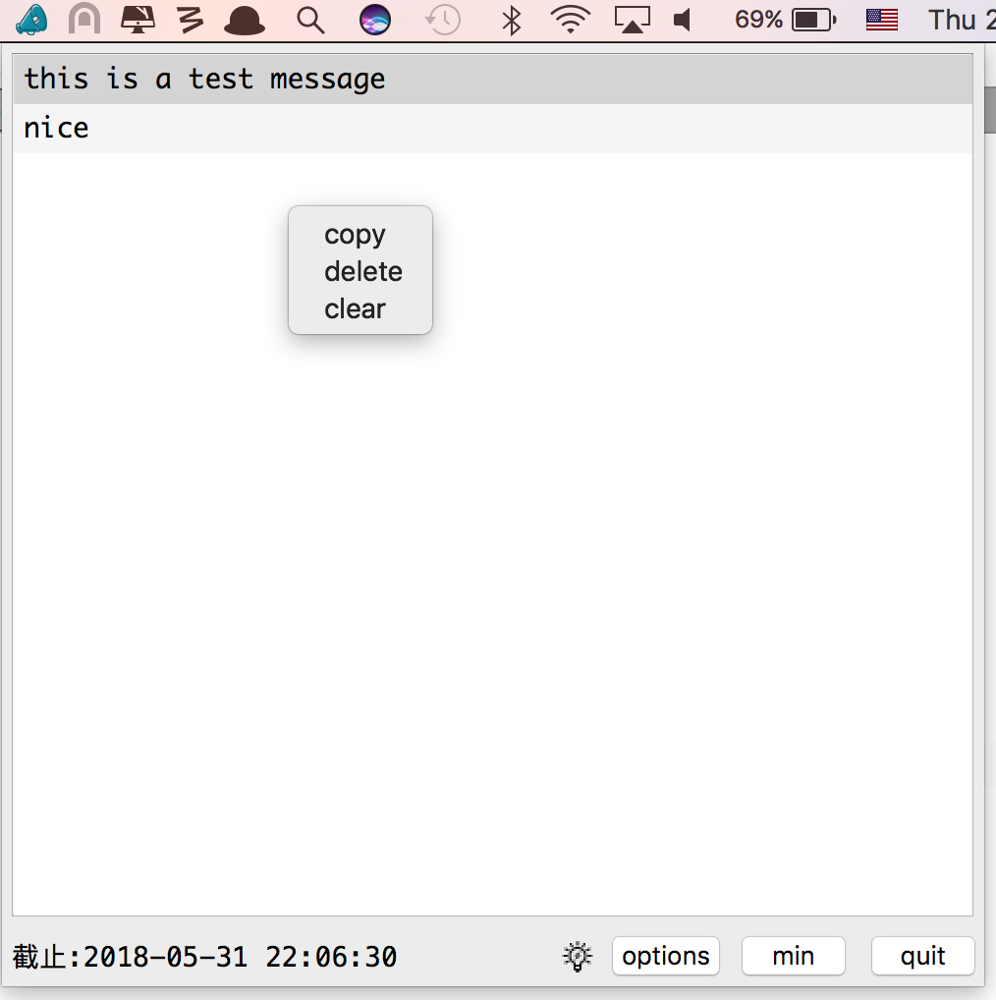
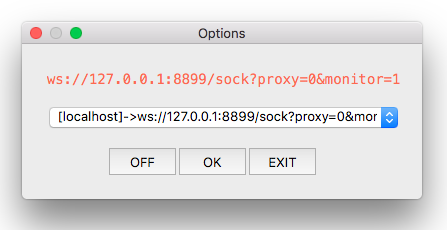

## version
```
v0.0.5
```

## config
```
[common]
url=default
enabled=false

[url]
default="ws://127.0.0.1:8899/sock?proxy=0&monitor=1"

[http]
minThreads=1
port=7878
```
* cat ~/.config/ixqbar/ctips.ini


## by local http server
```
curl -d '{"title":"pay","message":"nice"}' 'http://localhost:7878/'
```

## by remote websocket server
```
<?php

$redis_handle = new Redis();
$redis_handle->connect('127.0.0.1', 6899);
$redis_handle->rawCommand("npush", "*", '{"title":"pay","message":"nice"}');
```
* https://github.com/jonnywang/fcgiProxy






## thanks
* qt
* http://stefanfrings.de/qtwebapp/index.html
